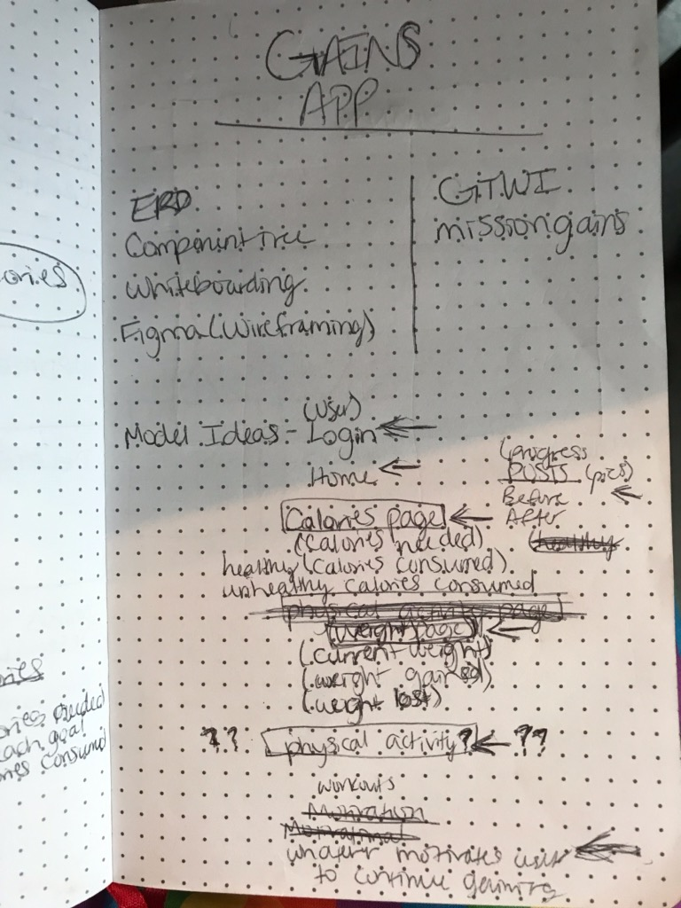
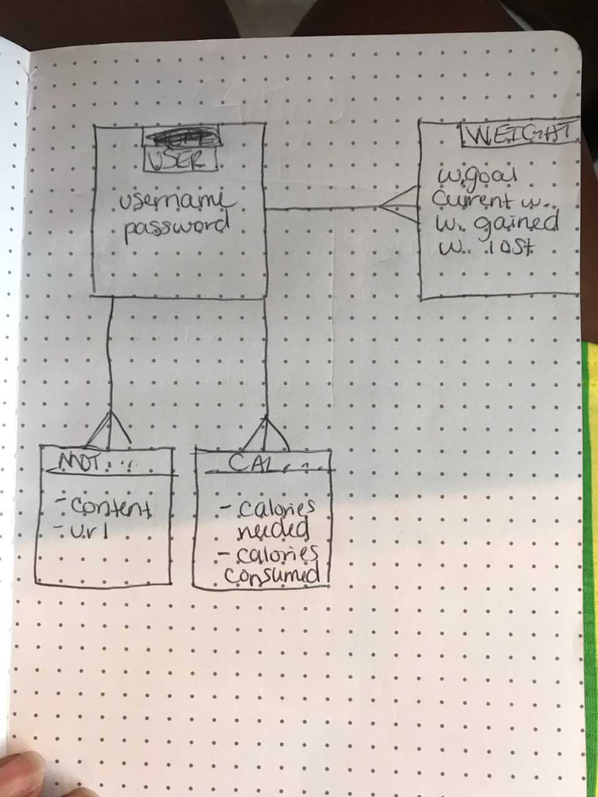
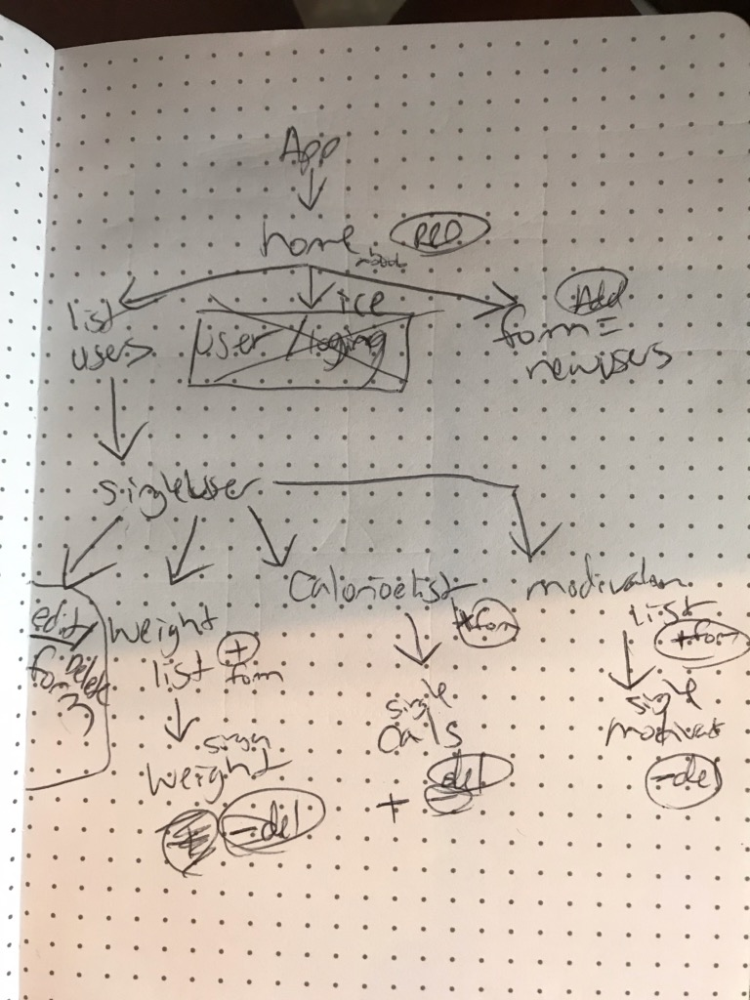

# Gains

I created this app because it's needed. There are many weight loss apps and resources around, but I rarely see resources to assist people gain weight. However, people that want to gain weight exist. This app will help keep track current, past, and present weight, daily calorie intake, as well as the weight goal the individual wishes to achieve.

## Link to deployed app
https://gtwi.herokuapp.com/

## Link to Trello Board
https://trello.com/b/kTlgm2LB/gains

## Whiteboard/Wireframe

## Stretch Goals
*In the very near future, I plan to incorporate a calendar within the app so that it's more accurate and beneficial to users
*I also plan to incorporate a motivation model.

